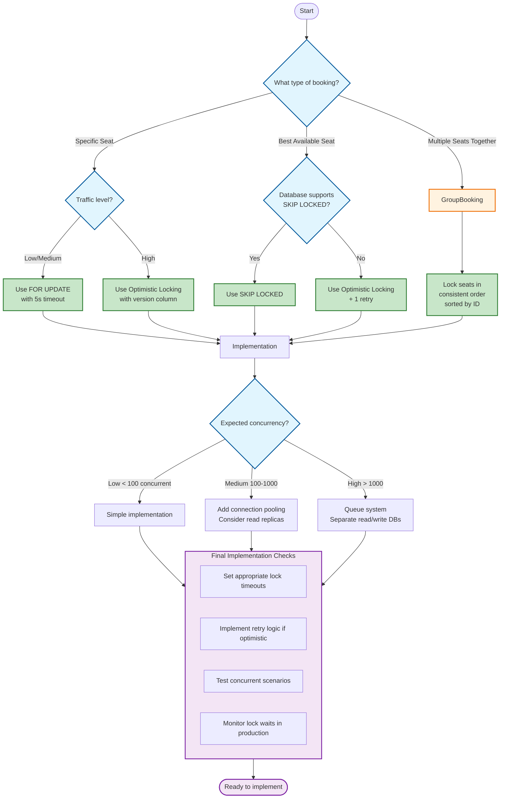

# **Comprehensive Guide: Locking Mechanisms for Ticket Booking Systems**

## **Table of Contents**
1. [Core Problem: Double Booking](#core-problem)
2. [Solution Spectrum: From Simple to Complex](#solution-spectrum)
3. [Detailed Scenario Analysis](#scenario-analysis)
4. [Implementation Patterns](#implementation-patterns)
5. [Decision Framework](#decision-framework)

---

## **1. Core Problem: Double Booking** <a name="core-problem"></a>

### **The Fundamental Issue**
When two users attempt to book the same resource simultaneously, without proper controls:
- Both see resource as available
- Both proceed with booking
- Database accepts both
- **Result:** One user gets disappointed, data inconsistency

### **Why Simple Checks Fail**
```sql
-- NAIVE APPROACH (DOESN'T WORK)
-- User A and User B both run:
BEGIN;
-- Step 1: Check availability
SELECT status FROM seats WHERE seat_id = 'B5';
-- Both see: 'available'

-- Step 2: Book if available
UPDATE seats SET status = 'booked' WHERE seat_id = 'B5';
-- Both succeed! Double booking occurs.
COMMIT;
```

**Problem:** The check and update are **not atomic**. Between SELECT and UPDATE, another transaction can intervene.

---

## **2. Solution Spectrum: From Simple to Complex** <a name="solution-spectrum"></a>

### **2.1 Basic Solution: Row-Level Locking (FOR UPDATE)**

```sql
-- SOLUTION 1: Row lock
BEGIN;
-- This LOCKs the row for our transaction
SELECT * FROM seats WHERE seat_id = 'B5' FOR UPDATE;

-- Now safe to check and update
UPDATE seats SET status = 'booked' WHERE seat_id = 'B5';
COMMIT;
```

#### **How it works:**
- First transaction to execute `FOR UPDATE` gets exclusive lock
- Other transactions **wait** for lock release
- Guarantees only one booking succeeds

#### **When to use:**
- Good for: Booking **specific, known seat** (e.g., "I want seat B5")
- Good for: Simple, predictable locking
- Good for: All databases support it

#### **Limitations:**
- Problem: Waiting transactions may timeout
- Problem: Can cause deadlocks with multiple resources
- Problem: Not optimal for "any available seat" scenario

---

### **2.2 The "Any Available Seat" Problem**

#### **Scenario:**
2 seats available: B5 (center), B6 (side)
2 users want "best available seat"

```sql
-- Both users run:
SELECT * FROM seats 
WHERE screening_id = 123 AND status = 'available'
ORDER BY seat_quality DESC
LIMIT 1 FOR UPDATE;
```

#### **What can go wrong:**

| Scenario | Outcome | Problem |
|----------|---------|---------|
| Users lock different seats | B5 -> User A, B6 -> User B | Works, but might not be optimal |
| Both try to lock B5 simultaneously | Deadlock or one waits | Poor user experience |
| Only 1 seat left, both want it | One gets it, one fails | Need retry logic |

---

### **2.3 Advanced Solution A: Optimistic Locking**

#### **Concept:**
- Don't lock during read
- Check at update time if data changed
- Retry if failed (someone beat you)

#### **Implementation:**
```sql
-- Each seat has a version number
-- Seat B5: status='available', version=7

-- User A:
BEGIN;
-- 1. Read current state
SELECT seat_id, version FROM seats 
WHERE seat_id = 'B5';
-- Returns: version=7

-- 2. Attempt update with version check
UPDATE seats 
SET status = 'booked', version = 8 
WHERE seat_id = 'B5' AND version = 7;  -- CRITICAL: Check original version

-- 3. Check result:
-- If 1 row updated: SUCCESS
-- If 0 rows updated: Someone else changed it -> RETRY
COMMIT;
```

#### **Advantages:**
- High concurrency (no read locks)
- No deadlocks
- Fair: Everyone competes for best seats

#### **Disadvantages:**
- Requires retry logic in application
- Users may experience "seat taken, try another"
- More complex code

#### **When to use:**
- High-traffic booking (concert tickets)
- When fairness matters (first to commit wins)
- When you can tolerate retries

---

### **2.4 Advanced Solution B: SKIP LOCKED**

#### **Concept:**
- Skip already-locked rows
- Never wait for others
- Take whatever's available

#### **Implementation (PostgreSQL):**
```sql
BEGIN;

-- Get any available seat, skip locked ones
SELECT * FROM seats 
WHERE screening_id = 123 AND status = 'available'
ORDER BY seat_quality DESC
LIMIT 1 
FOR UPDATE SKIP LOCKED;

-- If returns a row: Got a seat!
-- If returns empty: All seats locked or gone
COMMIT;
```

#### **What happens:**
```
Timeline:
10:00:00 - User A: Locks seat B5
10:00:01 - User B: Runs SKIP LOCKED query
            Sees B5 is locked -> SKIPS IT
            Returns B6 instead
10:00:02 - User B: Books B6 immediately
```

#### **Advantages:**
- No waiting, no timeouts
- Simple code (no retry logic)
- Fast response time

#### **Disadvantages:**
- Database-specific (PostgreSQL, Oracle, MySQL 8.0+)
- May give "leftover" seats (skips contested ones)
- Less fair: Quick clicker might not get best seat

#### **When to use:**
- Simplicity is priority
- Using supported database
- Seat quality difference minimal

---

### **2.5 Handling Abandoned Carts: Lock Timeouts**

#### **Problem:**
User starts booking, gets distracted, lock held indefinitely:
```sql
-- User A:
BEGIN;
SELECT * FROM seats WHERE seat_id = 'B5' FOR UPDATE;
-- Goes AFK for 30 minutes...
-- Lock held entire time!

-- User B:
SELECT * FROM seats WHERE seat_id = 'B5' FOR UPDATE;
-- Waits 30 minutes! Terrible UX
```

#### **Solution: Set Lock Timeout**
```sql
BEGIN;
SET lock_timeout = '5s';  -- Max wait time

SELECT * FROM seats WHERE seat_id = 'B5' FOR UPDATE;
-- Outcome 1: Lock acquired within 5s -> proceed
-- Outcome 2: Still locked after 5s -> ERROR: lock timeout

-- Handle timeout:
-- ROLLBACK; (or COMMIT if other changes)
-- Show user: "Seat unavailable, try another"
```

#### **Recommended Timeouts:**
- **UI operations:** 2-5 seconds
- **Background jobs:** 10-30 seconds
- **Batch processing:** 1-5 minutes

---

## **3. Detailed Scenario Analysis** <a name="scenario-analysis"></a>

### **Scenario 1: Specific Seat Selection**
**User:** "I want seat B5 specifically"

| Approach | Implementation | Advantages | Disadvantages |
|----------|---------------|------------|---------------|
| **FOR UPDATE** | `SELECT ... FOR UPDATE` | Simple, guaranteed | May wait/timeout |
| **Optimistic** | Version check on update | No waiting | Needs retry if fails |
| **NOWAIT** | `SELECT ... FOR UPDATE NOWAIT` | Immediate feedback | May fail unnecessarily |

**Recommendation:** `FOR UPDATE` with 2-5 second timeout

---

### **Scenario 2: Best Available Seat**
**User:** "Give me the best seat available"

| Approach | Implementation | Advantages | Disadvantages |
|----------|---------------|------------|---------------|
| **SKIP LOCKED** | `SELECT ... FOR UPDATE SKIP LOCKED` | Fast, no retries | Skips contested seats |
| **Optimistic + Retry** | Try best, retry if fails | Fair competition | Complex, may retry multiple times |
| **Queue-based** | Process sequentially | Simple, fair | Slow, poor concurrency |

**Recommendation:** **SKIP LOCKED** if supported, otherwise **Optimistic with 1 retry**

---

### **Scenario 3: Group Booking**
**User:** "I need 4 seats together"

**Problem:** Need to lock multiple seats atomically

```sql
-- Problematic: Deadlock risk!
BEGIN;
SELECT * FROM seats WHERE seat_id IN ('B5', 'B6', 'B7', 'B8') FOR UPDATE;
-- Another user might lock them in different order -> DEADLOCK
```

**Solution:**
```sql
-- 1. Always lock in consistent order (e.g., sort by seat_id)
BEGIN;
SELECT * FROM seats 
WHERE seat_id IN ('B5', 'B6', 'B7', 'B8')
ORDER BY seat_id  -- CRITICAL: Consistent order
FOR UPDATE;

-- 2. Or use table lock (heavy)
LOCK TABLE seats IN SHARE ROW EXCLUSIVE MODE;

-- 3. Or use advisory locks (PostgreSQL)
SELECT pg_advisory_xact_lock(123456);  -- Lock screening
```

---

### **Scenario 4: High-Concert Demand**
**Situation:** 1000 users trying for 100 seats in first second

| Consideration | Solution |
|---------------|----------|
| **Database load** | Use connection pooling, consider Redis queue |
| **Fairness** | Queue system, lottery, or optimistic locking |
| **User experience** | "You're in queue" vs "Seat taken, try another" |
| **Technical** | Read replica for seat display, primary for booking |

**Hybrid Approach:**
1. Show available seats from read replica
2. Booking uses optimistic locking on primary
3. Failed bookings get quick retry with next-best seat

---

## **4. Implementation Patterns** <a name="implementation-patterns"></a>

### **Pattern 1: Complete Booking Flow with FOR UPDATE**
```sql
-- Recommended for most use cases
BEGIN;
SET lock_timeout = '5s';

-- 1. Lock the seat(s)
SELECT * FROM seats 
WHERE seat_id = $1 
FOR UPDATE;

-- 2. Validate still available
-- (Application checks status from returned row)

-- 3. Update seat
UPDATE seats 
SET status = 'booked', 
    user_id = $user_id,
    booked_at = NOW()
WHERE seat_id = $1;

-- 4. Create booking record
INSERT INTO bookings (user_id, seat_id, screening_id, booked_at)
VALUES ($user_id, $1, $screening_id, NOW());

COMMIT;
```

### **Pattern 2: Optimistic Booking with Retry**
```python
# Application-level retry logic
max_retries = 3
retry_count = 0

while retry_count < max_retries:
    # 1. Get best available seat
    seat = db.execute("""
        SELECT seat_id, version 
        FROM seats 
        WHERE screening_id = %s AND status = 'available'
        ORDER BY seat_quality DESC 
        LIMIT 1
    """, [screening_id])
    
    if not seat:
        return "No seats available"
    
    # 2. Attempt booking
    rows_updated = db.execute("""
        UPDATE seats 
        SET status = 'booked', version = version + 1
        WHERE seat_id = %s AND version = %s
    """, [seat.seat_id, seat.version])
    
    if rows_updated == 1:
        # Success!
        return f"Booked seat {seat.seat_id}"
    else:
        # Someone beat us, retry
        retry_count += 1
        continue

return "Failed after retries, please try again"
```

### **Pattern 3: SKIP LOCKED with Fallback**
```sql
BEGIN;
SET lock_timeout = '2s';

-- Try for preferred seat
SELECT * FROM seats 
WHERE seat_id = $preferred_seat_id
FOR UPDATE NOWAIT;

-- If that fails (returns empty), get any seat
IF NOT FOUND THEN
    SELECT * FROM seats 
    WHERE screening_id = $screening_id 
      AND status = 'available'
    LIMIT 1 
    FOR UPDATE SKIP LOCKED;
END IF;

-- If we have a seat, book it
IF FOUND THEN
    UPDATE seats SET status = 'booked' 
    WHERE seat_id = $seat_id;
    COMMIT;
ELSE
    ROLLBACK;
    -- Show: "No seats available"
END IF;
```

---

## **5. Decision Framework** <a name="decision-framework"></a>

### **Choose based on these factors:**

#### **1. Database Capabilities:**
- **PostgreSQL/Oracle/MySQL 8.0+:** SKIP LOCKED available
- **Older MySQL/SQLite:** Need optimistic locking or FOR UPDATE
- **All:** FOR UPDATE available

#### **2. User Expectations:**
- **"I want THIS seat":** FOR UPDATE with timeout
- **"Best available":** SKIP LOCKED or optimistic
- **"Any seat":** Simple FOR UPDATE

#### **3. Traffic Levels:**
- **Low traffic:** FOR UPDATE is fine
- **High traffic:** Optimistic or SKIP LOCKED
- **Extreme traffic (Ticketmaster-scale):** Queue system + optimistic

#### **4. Fairness Requirements:**
- **First-come-first-served:** Optimistic locking
- **Speed matters:** SKIP LOCKED
- **Group seating:** Consistent order locking

### **Decision Matrix:**

| Scenario | Recommended Approach | Why |
|----------|---------------------|-----|
| **Specific seat, low traffic** | FOR UPDATE + 5s timeout | Simple, reliable |
| **Specific seat, high traffic** | Optimistic locking | No waiting, handles contention |
| **Best seat, any traffic** | SKIP LOCKED (if DB supports) | Fast, simple |
| **Best seat, no SKIP LOCKED** | Optimistic + 1 retry | Fair competition |
| **Group booking** | FOR UPDATE + consistent order | Prevents deadlocks |
| **Flash sale** | Queue system + optimistic | Handles extreme load |

---

## **6. Anti-Patterns to Avoid**

### **Polling instead of locking (BAD):**
```sql
-- BAD: Polling loop
WHILE seat_available LOOP
    SELECT status FROM seats WHERE seat_id = 'B5';
    -- Race condition here!
    UPDATE seats SET status = 'booked' WHERE seat_id = 'B5';
END LOOP;
```

### **No timeout on locks (BAD):**
```sql
-- BAD: Could wait forever
SELECT * FROM seats FOR UPDATE;
-- User goes to lunch -> lock held for hours
```

### **Locking in random order (BAD):**
```sql
-- BAD: Deadlock prone
-- Transaction A: Locks seat B5, then wants B6
-- Transaction B: Locks seat B6, then wants B5
-- DEADLOCK!
```

### **Over-locking (BAD):**
```sql
-- BAD: Locking entire table
LOCK TABLE seats IN EXCLUSIVE MODE;
-- Kills concurrency
```

---

## **7. Testing Your Implementation**

### **Test scenarios to simulate:**

1. **Two users, same seat:** Should only one succeed
2. **User abandons cart:** Lock should timeout, seat released
3. **Group booking deadlock:** Multiple seats, multiple users
4. **Concurrent bulk booking:** 10+ users at once
5. **Network failure mid-transaction:** Lock should release

### **Monitoring:**
```sql
-- Check for long-running locks (PostgreSQL)
SELECT * FROM pg_locks 
WHERE granted = false 
  OR age(now(), query_start) > interval '5 seconds';

-- Check for deadlocks in logs
-- MySQL: SHOW ENGINE INNODB STATUS;
-- PostgreSQL: log_lock_waits = on
```

---

## **8. Summary Checklist for Implementation**

### **When building your booking system:**

- [ ] **Identify your primary scenario:** Specific seat vs best available
- [ ] **Choose locking strategy** based on DB capabilities and traffic
- [ ] **Always use timeouts** to prevent indefinite waiting
- [ ] **Implement retry logic** for optimistic approaches
- [ ] **Test concurrent scenarios** thoroughly
- [ ] **Monitor lock waits** in production
- [ ] **Have fallback seats** for failed bookings
- [ ] **Consider user experience** during contention
- [ ] **Document your approach** for team understanding

---

This guide should serve as a comprehensive reference. The key insight: **There's no one-size-fits-all solution.** Your choice depends on database capabilities, user expectations, traffic patterns, and fairness requirements.

**Remember:** Start simple (`FOR UPDATE` with timeout), measure contention in production, and evolve your approach as needed. Most booking systems don't need extreme complexity until they're operating at massive scale.

---

# **Decision Flow: Choosing a Locking Strategy for Ticket Booking**



## **Detailed Decision Guide**

### **Step 1: Identify Your Booking Type**

**A. Specific Seat Selection** ("I want seat B5")
```
User -> Specific Seat ID -> Book
```
**Solution Path:** Use `FOR UPDATE` or Optimistic Locking based on traffic

**B. Best Available Seat** ("Give me the best seat available")
```
User -> Best Seat Query -> Book
```
**Solution Path:** Use `SKIP LOCKED` if available, otherwise Optimistic

**C. Multiple Seats Together** ("I need 4 adjacent seats")
```
User -> Find Adjacent Seats -> Lock All -> Book
```
**Solution Path:** Always lock in consistent order to prevent deadlocks

---

### **Step 2: Choose Your Core Locking Strategy**

#### **For Specific Seat:**

```python
def choose_specific_seat_strategy(traffic_level):
    if traffic_level in ['low', 'medium']:
        return {
            'strategy': 'FOR_UPDATE',
            'implementation': 'SELECT ... FOR UPDATE',
            'timeout': '5 seconds',
            'pros': ['Simple', 'Guaranteed atomicity'],
            'cons': ['May cause waiting', 'Timeout handling needed']
        }
    else:  # high traffic
        return {
            'strategy': 'OPTIMISTIC',
            'implementation': 'Version column + conditional update',
            'retries': 2,
            'pros': ['No waiting', 'Better concurrency'],
            'cons': ['Need retry logic', 'Users may see "seat taken"']
        }
```

#### **For Best Available Seat:**

```python
def choose_best_seat_strategy(database_type):
    if database_type in ['PostgreSQL', 'Oracle', 'MySQL 8.0+']:
        return {
            'strategy': 'SKIP_LOCKED',
            'implementation': 'SELECT ... FOR UPDATE SKIP LOCKED',
            'fallback': 'Try multiple times with delay',
            'pros': ['No waiting', 'Simple code'],
            'cons': ['Database-specific', 'May skip best seats']
        }
    else:
        return {
            'strategy': 'OPTIMISTIC_WITH_RETRY',
            'implementation': 'Try best seat, retry if fails',
            'retries': 1,
            'fallback_seat': 'Next best available',
            'pros': ['Works on all DBs', 'Fair competition'],
            'cons': ['Complex logic', 'May need multiple attempts']
        }
```

#### **For Group Booking:**

```python
def group_booking_strategy():
    return {
        'strategy': 'CONSISTENT_ORDER_LOCKING',
        'implementation': 'Lock seats sorted by ID',
        'pseudocode': '''
            BEGIN;
            -- Always lock in same order
            SELECT * FROM seats 
            WHERE seat_id IN ($seat_ids)
            ORDER BY seat_id
            FOR UPDATE;
            -- Proceed if all available
            COMMIT;
        ''',
        'critical': 'Never lock seats in random order',
        'alternative': 'Use table-level lock if group must be atomic'
    }
```

---

### **Step 3: Consider Traffic Levels**

#### **Low Traffic (< 100 concurrent users):**
```
Recommended: Keep it simple
- FOR UPDATE for specific seats
- Simple retry logic if needed
- 5-10 second timeouts
```

#### **Medium Traffic (100-1000 concurrent):**
```
Recommended: Optimize for concurrency
- Consider optimistic locking
- Use connection pooling
- Implement circuit breakers
- Set appropriate timeouts (2-5 seconds)
```

#### **High Traffic (> 1000 concurrent):**
```
Recommended: Distributed approach
- Queue system for fairness
- Separate read/write databases
- Redis for session management
- Load testing mandatory
```

---

### **Step 4: Quick Reference Decision Table**

| Use Case | Low Traffic | High Traffic | Database Limitation |
|----------|-------------|--------------|---------------------|
| **Specific Seat** | FOR UPDATE + timeout | Optimistic + retry | All databases |
| **Best Seat** | SKIP LOCKED if available<br>else Optimistic | Same, with queue for fairness | SKIP LOCKED requires modern DB |
| **Group Seats** | Consistent order locking | Same + timeout + fallback | All databases |
| **Flash Sale** | Not recommended | Queue system + optimistic | Consider specialized solutions |

---

### **Step 5: Implementation Checklist**

**Before Coding:**
- [ ] Confirm database capabilities
- [ ] Estimate peak concurrent users
- [ ] Define timeout values (UI: 2-5s, Batch: 30s+)
- [ ] Plan retry strategy (how many? with delay?)

**During Implementation:**
- [ ] Add comprehensive logging
- [ ] Implement monitoring for lock waits
- [ ] Create automated concurrency tests
- [ ] Set up alerting for deadlocks

**After Deployment:**
- [ ] Monitor average lock wait time
- [ ] Track booking failure rate
- [ ] Adjust timeouts based on real data
- [ ] Plan scaling strategy

---

### **Step 6: Common Pitfalls & Solutions**

**Pitfall 1: "My users wait too long"**
```
Solution:
1. Reduce lock_timeout to 2-3 seconds
2. Implement "seat hold" with optimistic locking
3. Show "finding seats" animation during lock
```

**Pitfall 2: "Too many failed bookings"**
```
Solution:
1. Implement smart retry with exponential backoff
2. Offer alternative seats immediately
3. Consider SKIP LOCKED for faster alternatives
```

**Pitfall 3: "Database deadlocks"**
```
Solution:
1. Always lock in consistent order (sort by ID)
2. Reduce transaction time (do less in transaction)
3. Implement deadlock retry in application
```

---

## **Emergency Decision Flow (When in doubt)**

```
If unsure, choose this path:

1. Start with FOR UPDATE + 5 second timeout
2. Monitor lock wait times in production
3. If waits > 1 second, switch to optimistic locking
4. If using PostgreSQL/Oracle/MySQL 8+, try SKIP LOCKED
5. For groups: ALWAYS lock in consistent order
```

**Remember:** The simplest solution that works for your scale is usually the best. You can always evolve as your traffic grows.

---

## **Final Recommendation Matrix**

| Scenario | First Choice | Fallback | When to Avoid |
|----------|-------------|----------|---------------|
| Booking specific seat, known traffic | FOR UPDATE | Optimistic | When users must never wait |
| Booking best seat, modern DB | SKIP LOCKED | Optimistic + retry | When fairness is critical |
| Group booking | Consistent order | Table lock | When you can't sort seats |
| Unknown requirements | FOR UPDATE + timeout | Monitor and adjust | When you have time to test |

**Key Principle:** Test with production-like load before final decision. Simulate 2x your expected peak users to ensure your strategy holds up.
